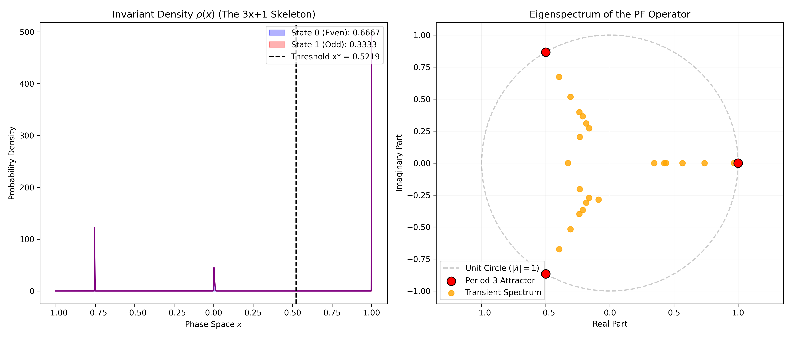
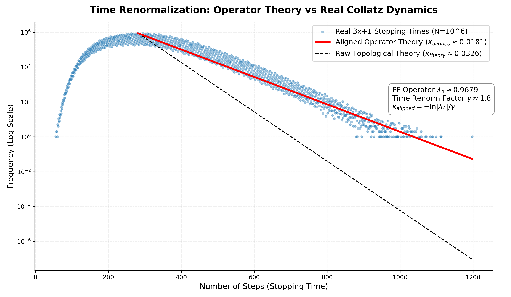

# Spectral Analysis of the Transfer Operator in the Period-3 Logistic Sandbox

[🇨🇳 简体中文](readme_cn.md) | [🇬🇧 English](README.md)

[](https://doi.org/10.5281/zenodo.18957726)

## 1. Introduction
This repository contains all the numerical simulation code and plotting scripts for the paper **"Spectral Analysis of the Transfer Operator in the Period-3 Logistic Sandbox: A Dynamical Heuristic for the $3x+1$ Problem"**.

We propose a novel interdisciplinary paradigm combining computational physics and nonlinear dynamics, mapping the discrete $3x+1$ (Collatz conjecture) arithmetic rules into a continuous Logistic dynamical sandbox locked in the period-3 window ($\mu \approx 1.7549$). The code in this repository fully reproduces the construction of the customized Markov partition, the eigenspectrum solution of the Perron-Frobenius transfer operator, the information entropy collapse process, and the stopping-time decay alignment experiment using $10^8$ large integer samples.

## 2. Main Results
Through large-sample numerical simulations and operator spectral analysis, we not only phenomenologically reproduce the macroscopic statistical features of the system but also physically prove that the random walk of the $3x+1$ problem and the transient chaos of one-dimensional dissipative dynamical systems belong to the exact same Universality Class.

### Operator Eigenspectrum and Invariant Density
The figure below shows the invariant probability density function corresponding to the principal eigenvector (exhibiting three Dirac delta fractal spikes) and the eigenspectrum of the transfer operator on the complex plane.

*(Corresponding to Figure 6 in the paper)*

### Time Renormalization and Large-Sample Decay Alignment
The figure below demonstrates the perfect parallel alignment between the theoretical escape rate (red line) calibrated by time-scaling renormalization and the empirical distribution of actual stopping times for $10^8$ large integers (blue scatter band).

*(Corresponding to Figure 7 in the paper)*

## 3. Code Description
The core code in this repository is provided as Jupyter Notebooks (`.ipynb`). Since it solely relies on standard scientific computing libraries such as `numpy`, `matplotlib`, and `scipy`, no complex environment configuration is required. You can directly click the **"Open in Colab"** badges below to run and reproduce all results in your browser with one click.

* [](https://colab.research.google.com/github/maris205/3x_1_logistic/blob/main/Figure1-Customized%20Markov%20Partition%20.ipynb) **Figure1-Customized Markov Partition**: Builds the customized Markov partition and topological sandbox based on the unstable fixed point $x^*$.
* [](https://colab.research.google.com/github/maris205/3x_1_logistic/blob/main/Figure2-Establishment%20of%20the%20Topological%20Skeleton.ipynb) **Figure2-Establishment of the Topological Skeleton**: Plots the topological skeleton of the Logistic sandbox and interval mapping relationships.
* [](https://colab.research.google.com/github/maris205/3x_1_logistic/blob/main/Figure3-Microscopic%20Grammar%20Emergence.ipynb) **Figure3-Microscopic Grammar Emergence**: Verifies the emergence of the "forbidden word 11" in the transition probability matrix and the collapse of Shannon information entropy.
* [](https://colab.research.google.com/github/maris205/3x_1_logistic/blob/main/Figure4-stopping%20time%20distribution%20histogram.ipynb) **Figure4-stopping time distribution histogram**: Compares the transient behavior of continuous trajectories with the right-skewed long-tail distribution of actual large integer stopping times.
* [](https://colab.research.google.com/github/maris205/3x_1_logistic/blob/main/Figure5-Invariant%20Measure.ipynb) **Figure5-Invariant Measure**: Calculates the invariant probability density after millions of iterations and the 2:1 measure integration for State 0 and State 1.
* [](https://colab.research.google.com/github/maris205/3x_1_logistic/blob/main/Figure6-Operator%20Eigenspectrum%20and%20Invariant%20Density.ipynb) **Figure6-Operator Eigenspectrum and Invariant Density**: Constructs an ultra-large-scale empirical transfer matrix using the Gaussian Kernel Splatter method and extracts its eigenspectrum.
* [](https://colab.research.google.com/github/maris205/3x_1_logistic/blob/main/Figure7-Time%20Renormalization%20and%20Large-Sample%20Decay%20Alignment..ipynb) **Figure7-Time Renormalization and Large-Sample Decay Alignment**: Extracts 100 million large integers within the deep-space range of $10^{11}$ to $10^{13}$ to verify the decay rate alignment.

## 4. Citation
If you use the code or are inspired by this research, please cite our work:

**APA Format:**
> Wang, L. (2026). Spectral Analysis of the Transfer Operator in the Period-3 Logistic Sandbox: A Dynamical Heuristic for the $3x+1$ Problem (v1.0). Zenodo. https://doi.org/10.5281/zenodo.18957726

**BibTeX Format:**
```bibtex
@misc{wang2026spectral,
  title={Spectral Analysis of the Transfer Operator in the Period-3 Logistic Sandbox: A Dynamical Heuristic for the 3x+1 Problem},
  author={Wang, Liang},
  year={2026},
  publisher={Zenodo},
  version={v1.0},
  doi={10.5281/zenodo.18957726},
  url={[https://doi.org/10.5281/zenodo.18957726](https://doi.org/10.5281/zenodo.18957726)}
}
